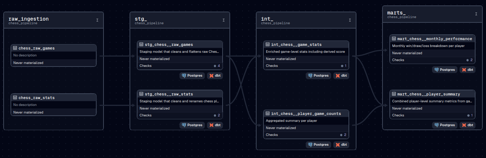

# Chess Analytics Pipeline

This repository is prepared by [Pipeline To Insights](https://pipeline2insights.substack.com/) for tutorial purposes as part of: [Pipeline To Insights Data Engineering Interview Series](https://pipeline2insights.substack.com/t/interview-preperation)

This project implements an end-to-end data pipeline that ingests player and game data from [Chess.com](https://www.chess.com/), loads it into a PostgreSQL database, transforms it using dbt, and orchestrates everything using Dagster.

## Project Overview

**Main Features:**

- Extracts top chess player statistics and game history using the [Chess.com API](https://www.chess.com/news/view/published-data-api).
- Loads raw data into a local PostgreSQL database.
- Transforms and models the data using `dbt` with layered architecture: `staging`, `intermediate`, and `marts`.
- Orchestrated with `Dagster` to enable visual DAGs, scheduling, and observability.
- Scheduled to run weekly.



## Technologies Used

| Tool        | Purpose                              |
|-------------|---------------------------------------|
| Dagster     | Workflow orchestration and scheduling |
| dbt         | SQL-based data transformations        |
| PostgreSQL  | Raw + analytics storage               |
| Chess.com API | Source of player + game data       |
| Python      | Custom extract/load logic             |

## Setup

### 1. Clone the Repo

```bash
git clone https://github.com/pipelinetoinsights/dagster-dbt-orchestration-example.git
cd dagster-dbt-orchestration-example
```

### 2. Create a Virtual Environment

```bash
python3 -m venv venv
source venv/bin/activate
```

### 3. Install Requirements

```bash
pip install -r requirements.txt
```

### 4. Set Up PostgreSQL
Make sure a local Postgres instance is running. Set your credentials in:

- `ingestion/.env.example` then rename it to `.env`
- `dbt/profiles.yml`

### 5. Initialize dbt
Initialize dbt and ensure its connection to DB.

```bash
cd dbt
dbt deps
dbt debug
```

### 6. Run Locally with Dagster

```bash
cd chess_pipeline
dagster dev
```

Open your browser at: `http://localhost:3000`

Check `Assets` to see whole ELT assets.

Check `Jobs` to see scheduled Dagster job to run every Sunday at 2AM.